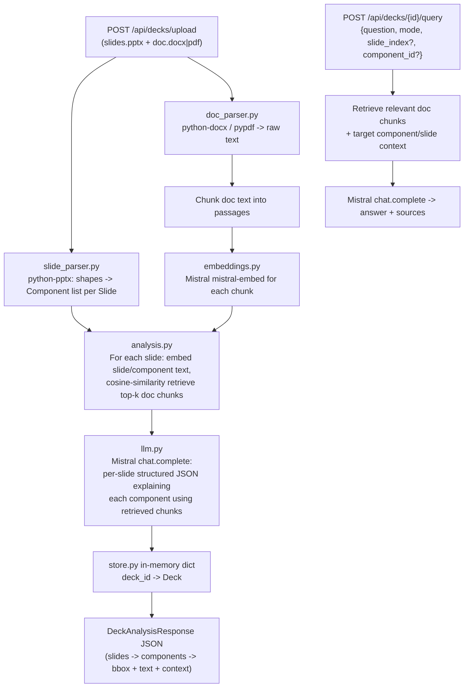

## Branch
Create and switch to a new branch, e.g. `feature/fastapi-slide-doc-backend`, off `main`.

## Overview / Flow



## New backend structure (all under `backend/`, frontend untouched)

```
backend/
  requirements.txt
  .env.example
  README.md
  app/
    __init__.py
    main.py              # FastAPI() app, CORS, include routers
    config.py            # pydantic-settings: MISTRAL_API_KEY, model names, chunk size
    store.py             # thread-safe in-memory dict: deck_id -> Deck
    models/
      schemas.py         # Pydantic: Component, Slide, Deck, DeckAnalysisResponse, QueryRequest/Response
    services/
      slide_parser.py    # python-pptx: iterate slides/shapes -> Component(type, bbox, text)
      doc_parser.py       # python-docx / pypdf -> raw text; chunk_text() splitter
      embeddings.py        # MistralEmbeddingsClient: embed(list[str]) -> vectors; cosine_similarity search
      llm.py                # MistralLLMClient: chat completion wrapper + prompt templates
      analysis.py            # orchestrates full pipeline -> builds Deck with per-component context
      qa.py                  # ask/summarize/explain endpoint logic (RAG over doc chunks)
    routers/
      decks.py             # POST /api/decks/upload, GET /api/decks/{id}, GET /api/decks
      query.py              # POST /api/decks/{id}/query
```

## Key implementation details

### Slide parsing (`services/slide_parser.py`)
Use `python-pptx`. For each slide, iterate `slide.shapes`; for each shape build a `Component`:
- `id`: `f"slide{slide_idx}-shape{shape_idx}"`
- `type`: derived from `shape.shape_type` (TITLE, BODY/TEXT_BOX, PICTURE, TABLE, CHART, GROUP, OTHER) plus placeholder type when available
- `bbox`: `{left, top, width, height}` normalized to 0-1 fractions of slide width/height (from `prs.slide_width/height`) so frontend can position overlays regardless of render scale
- `text`: `shape.text_frame.text` if it has one, table cell text concatenation for tables, alt text for pictures
- Also capture slide-level speaker notes text (useful extra context, not a hoverable component)

### Doc parsing (`services/doc_parser.py`)
- `.docx` via `python-docx` (paragraphs + tables)
- `.pdf` via `pypdf` (per-page text extraction)
- `chunk_text(text, max_chars=~1000, overlap=~150)` to produce passages with a `source` label (paragraph/page index) for citing in responses

### Embeddings + retrieval (`services/embeddings.py`)
- Wrap `mistralai.Mistral().embeddings.create(model="mistral-embed", inputs=[...])`
- Embed all doc chunks once per deck upload; store vectors alongside chunk text in the in-memory `Deck`
- `top_k_similar(query_vector, chunk_vectors, k=4)` via numpy cosine similarity, no external vector DB (keeps things simple given in-memory storage)

### LLM matching (`services/llm.py`, `services/analysis.py`)
- One Mistral chat completion **per slide** (not per component) to limit calls: prompt includes the slide's components (id + text) and the top retrieved doc chunks for that slide (union of top-k per component or per whole-slide text), instructs the model to return strict JSON `{component_id: {"context": "...", "sources": [chunk_source,...]}}`
- Use `response_format={"type": "json_object"}` (Mistral supports JSON mode) and parse/validate with Pydantic; on parse failure, fall back to an empty context rather than failing the whole request
- Model default: `mistral-large-latest` for reasoning steps, `mistral-embed` for embeddings (configurable via `.env`)

### Upload endpoint (`routers/decks.py`)
- `POST /api/decks/upload` — multipart form with two files (`slides`, `doc`); validates extensions (.pptx / .docx,.pdf)
- Runs the full pipeline synchronously (parse -> chunk -> embed -> match -> LLM) and returns the complete `DeckAnalysisResponse` in one response, matching "after upload it scans ... this is returned to the frontend"
- Stores the resulting `Deck` (slides, components, doc chunks + embeddings) in the in-memory store keyed by a generated `deck_id`, so it can be reused by the query endpoint without re-uploading
- `GET /api/decks/{deck_id}` — re-fetch a previously processed deck
- `GET /api/decks` — list deck ids/filenames (lightweight helper for the frontend)

### Query endpoint (`routers/query.py`, `services/qa.py`)
- `POST /api/decks/{deck_id}/query` body: `{question: str, mode: "ask"|"summarize"|"explain", slide_index?: int, component_id?: str}`
- Looks up the deck from the store; if `component_id`/`slide_index` given, includes that component/slide's text + previously computed context as anchor; always does a fresh top-k retrieval from the doc chunks based on the question (or the anchor text when summarizing/explaining without a question)
- Builds a mode-specific prompt (ask = answer the question; summarize = summarize the component/slide/deck; explain = deeper explanation) and calls Mistral chat completion
- Returns `{answer: str, sources: [{text, source}]}`

### Config & dependencies
- `backend/requirements.txt`: `fastapi`, `uvicorn[standard]`, `python-multipart`, `python-pptx`, `python-docx`, `pypdf`, `mistralai`, `pydantic-settings`, `numpy`
- `backend/.env.example`: `MISTRAL_API_KEY=`, `MISTRAL_CHAT_MODEL=mistral-large-latest`, `MISTRAL_EMBED_MODEL=mistral-embed`
- `app/config.py` loads settings via `pydantic-settings`, raises a clear error at startup if `MISTRAL_API_KEY` missing
- CORS middleware enabled with permissive origins for local frontend dev (`app/main.py`)
- `backend/README.md`: setup/run instructions (`uvicorn app.main:app --reload`), env var setup, and example curl calls for upload + query

## Out of scope (per user request)
- No changes to any `frontend/` directory
- No web search / external research API integration (LLM + doc context only, per your answer)
- No persistent database (in-memory store only; data is lost on server restart)
